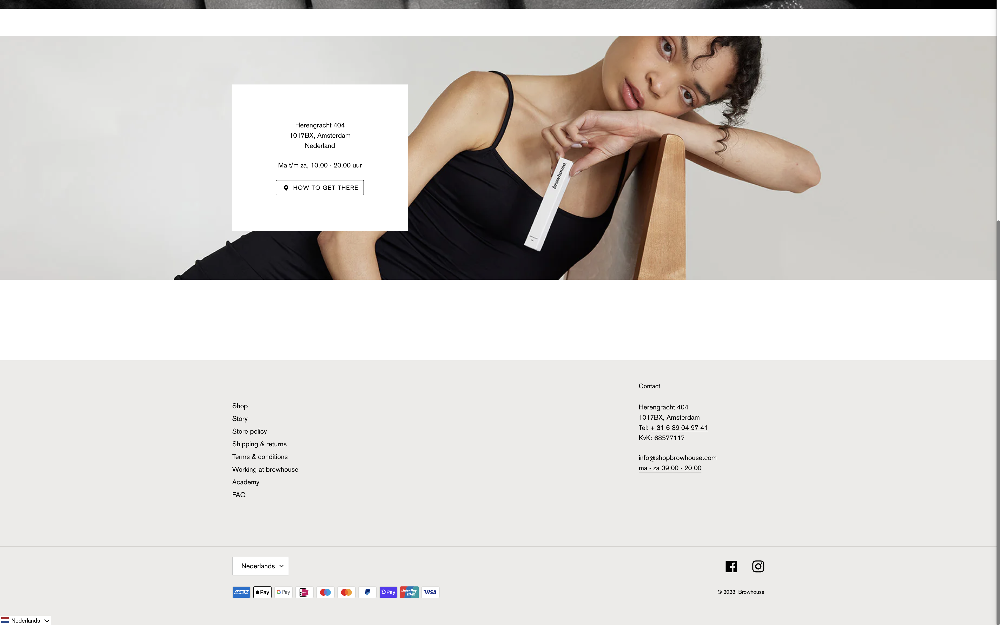
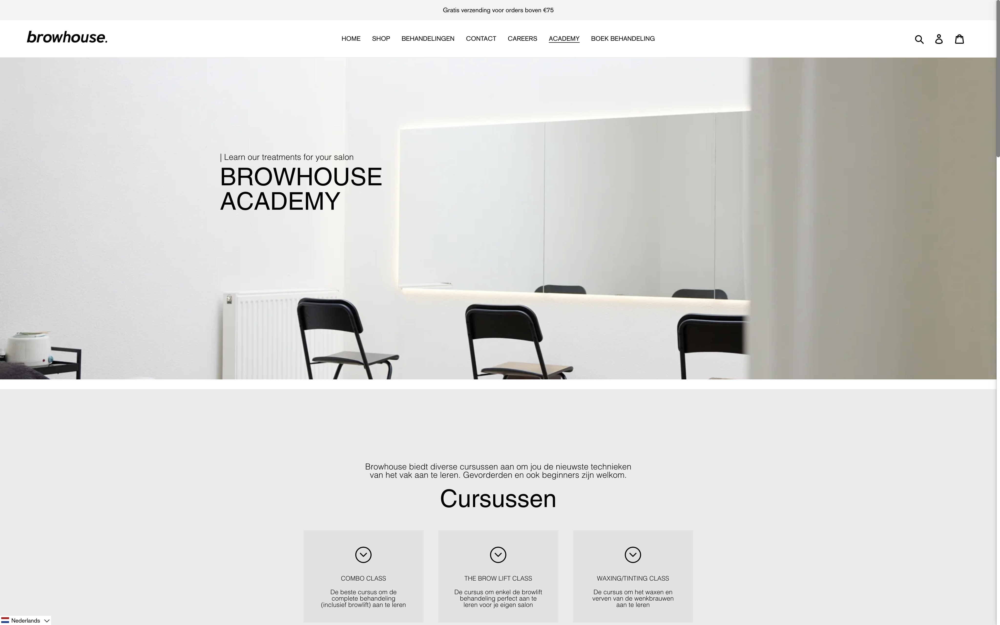
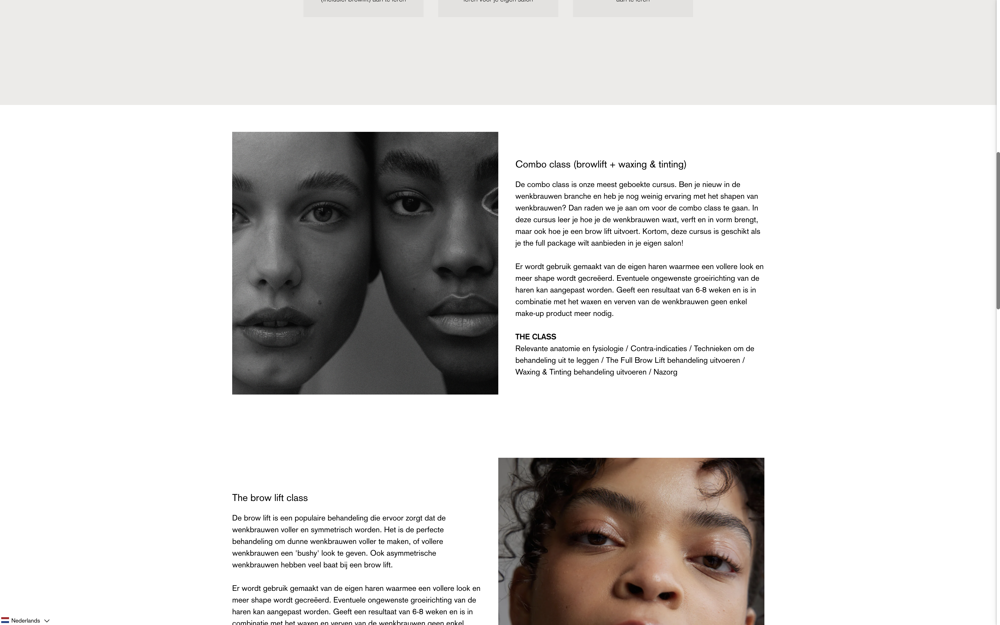
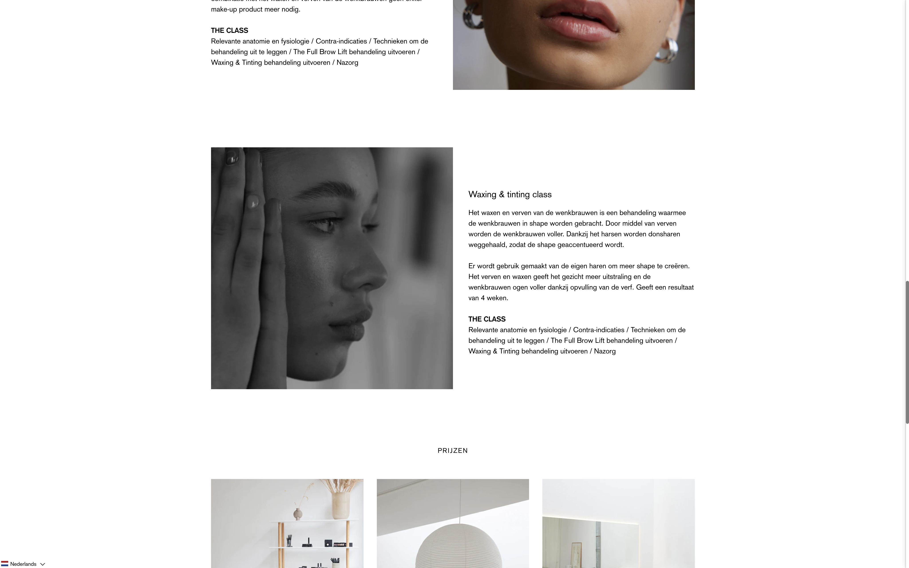
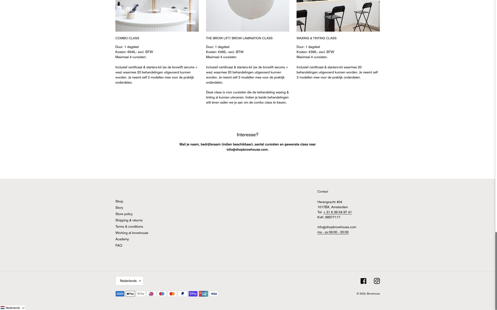
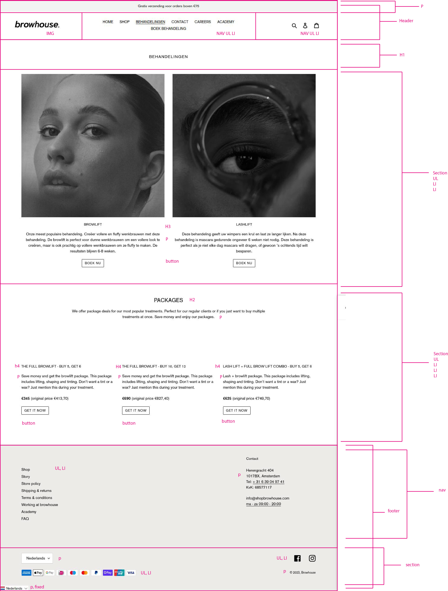

# Procesverslag
Markdown is een simpele manier om HTML te schrijven.  
Markdown cheat cheet: [Hulp bij het schrijven van Markdown](https://github.com/adam-p/markdown-here/wiki/Markdown-Cheatsheet).

Nb. De standaardstructuur en de spartaanse opmaak van de README.md zijn helemaal prima. Het gaat om de inhoud van je procesverslag. Besteedt de tijd voor pracht en praal aan je website.

Nb. Door *open* toe te voegen aan een *details* element kun je deze standaard open zetten. Fijn om dat steeds voor de relevante stuk(ken) te doen.

## Jij

  
uitwerken voor kick-off werkgroep

  ### Auteur:
  Magdalena Mijatovic

  #### Je startniveau:
  rood

  #### Je focus:
  responsive
 

## Je website

  
uitwerken voor kick-off werkgroep

  ### Je opdracht:
  https://www.browhouse.nl/nl

  #### Screenshot(s) van de eerste pagina (small screen): 
  behandelingen 
  

  

  #### Screenshot(s) van de tweede pagina (small screen):
  academy  
  

  

  

  
 

## Toegankelijkheidstest 1/2 (week 1)

  
uitwerken na test in 2e werkgroep

  ### Bevindingen
  - Het poppetje van account wordt voorgelezen als "komma link"
  - De alt van de plaatjes wordt niet voorgelezen 
  - De screenreader geeft goed aan waar de gebruiken zich bevind(welke selectie)
  - De screenreader gaat goed van boven naar beneden te werk
  - Het is onduidelijk als de screenreader  de verschillende categorieën zoals behandelingen en packages selecteert
  - Voor de rest is site goed bereikbaar met de screenreader
  

## Breakdownschets (week 1)

  
uitwerken na afloop 3e werkgroep

  ### de hele pagina: 
  

## Voortgang 1 (week 2)

  
uitwerken voor 1e voortgang

  ### Stand van zaken
  hier dit ging goed & dit was lastig (neem ook screenshots op van delen van je website en code)

  ### Agenda voor meeting
  samen met je groepje opstellen

  | Magdalena
  | ---
  | Ik krijg mijn font niet geïnstaleerd, snap niet hoe dat moet
  | Ik krijg de foto's niet naast elkaar in een column
  | Ik krijg de balk boven de nav bar niet over de gehele breedte van het scherm

  ### Verslag van meeting
  hier na afloop snel de uitkomsten van de meeting vastleggen

  - In je root importeren en dan een font-family maken. Heb via een site mijn woff2 bestand importeren. Ben erachter gekomen dat er een "normal", "italic" en "bold" van de fonts was. Daar heb ik ze nu naar vernoemd.
  - De balk naar 100% gezet, nu klopt het.
  - Voor de svg kun je via inspecteren de link kopieren en in je html zetten
  

## Voortgang 2 (week 3)

  
uitwerken voor 2e voortgang

  ### Stand van zaken
  hier dit ging goed & dit was lastig (neem ook screenshots op van delen van je website en code)

  ### Agenda voor meeting
  Ik zit deze week in een ander groepje, heb gevraagd in teams of ze agenda punten hadden. Ze zeiden soort van, niet echt.. Ik heb ook een groepschat aangemaakt, daar reageren ze niet op.

  | Magdalena  
  1. Ik snap niet hoe ik de foto's naast elkaar krijg met de tekst onder elke foto, en de button. 
  2. Ik krijg de iconen niet op de juiste grootte
  3. De foto's met de tekst en button moeten als het scherm kleiner wordt naast elkaar komen te staan.

  | Laura Mostert
  1. Gaat best lekker
  2. Site gebruikt geen javascript, hoe moet ze dit toepassen?
  

  | Dan Naumann
  1.  wist het nog niet
  

  | Diem Do
  1. Is er niet bij
         
  
  ### Verslag van meeting
  hier na afloop snel de uitkomsten van de meeting vastleggen

  - Heel fijn voorbeeld gekregen van Sanne in codepen! Dit heb ik aangehouden bij m'n eigen code(wel de minmax aangepast) en nu werkt dat stukje!
  - De iconen heb ik opniew geinporteerd incl viewport vanuit de inspecteren van de site. Toen ben ik gaan spelen met achtergrond kleuren zodat ik kon zien wat ik veranderde
  tijdens het coderen. Dit is een fijn hulpmiddel!
  

## Toegankelijkheidstest 2/2 (week 4)

  
uitwerken na test in 9e werkgroep

  ### Bevindingen
 De site kan met tab genavigeerd worden. De kopjes kloppen en alle afbeeldingen hebben een alt tekst. De site is ook overzichtelijker gecodeerd dan de orginele site.

## Voortgang 3 (week 4)

  
uitwerken voor 3e voortgang

  ### Stand van zaken
  hier dit ging goed & dit was lastig (neem ook screenshots op van delen van je website en code)

  ### Agenda voor meeting

  | Magdalena  
  1. Is het mogelijk om de buttons van de eerste foto's elke keer onderaan de ul te zetten ipv van de li? Zo is het lelijk
  2. Hoe krijg ik bij de tweede ul dat de de li smaller en langer worden totdat het scherm 749px is en dat ze dan onder elkaar komen. Dat tweede gedeelte lukt wel. Alleen nu blijven de li een bepaalde grootte waardoor ze over 2 rijen verdeeld worden ipv dat ze kleiner worden.

  | Laura Mostert
  1. Heeft geen vragen
  

  | Dan Naumann
  1.  Nog niks gestuurd
  

  | Diem Do
  1.  Nog niks gestuurd
 

  ### Verslag van meeting
  hier na afloop snel de uitkomsten van de meeting vastleggen

  - minmax moest worden vervangen door 3, nu klopt het!
  - flexbox nav, flexwrap en dan height in de header weghalen, padding toevoegen elementen voor ruimte.

## Eindgesprek (week 5)

  
uitwerken voor eindgesprek

  ### Je uitkomst - karakteristiek screenshots:
  

  ### Dit ging goed/Heb ik geleerd: 
Tijdens het coderen werken met kleuren om inzicht te krijgen wat je precies aanroept in css. Dit is super handig! Ook  het werken met grid was mij nog niet niet heel vetrouwd. Daar kon ik goed mee oefenen deze opdracht! Verder het maken van een responsive site in het algemeen had ik nog nooit gedaan. Ik vind het wel leuk om hier nog mee te oefenen
  

  ### Dit was lastig/Is niet gelukt:
  Ik kreeg die select van de valuta's maar met geen mogelijkheid goed bij de mediaquery. Ook op de about pagina met de laatste section die een afbeelding als achtergond heeft mist een stukje wit aan het onderkant. Snap niet waarom het niet werkt. Ik heb een derde pagina toegevoegd om nog iets van javascript te doen maar had geen tijd om dat uitgebreid te doen. 

  

## Bronnenlijst

  
continu bijhouden terwijl je werkt

  Nb. Wees specifiek ('css-tricks' als bron is bijv. niet specifiek genoeg). 
  Nb. ChatGpT en andere AI horen er ook bij.
  Nb. Vermeld de bronnen ook in je code.

  1. https://www.freecodecamp.org/news/html-new-line-br-tag-line-break/
  2. https://stackoverflow.com/questions/26819675/navbar-highlight-for-current-page
  3. https://www.html-code-generator.com/html/drop-down/currency-names

